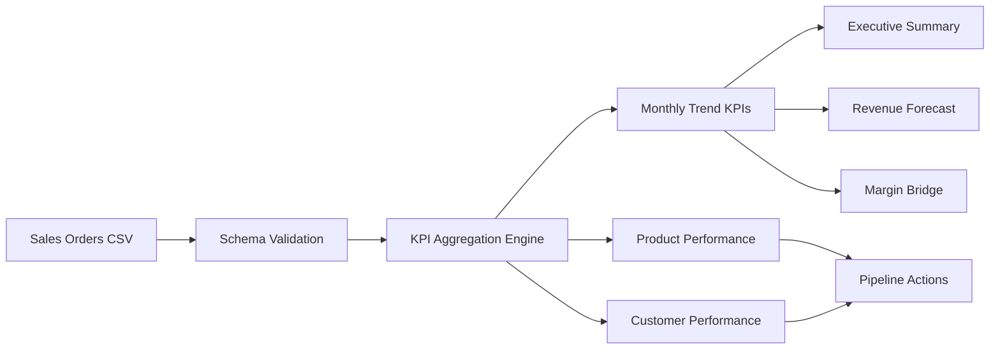

# Sales Performance Dashboard

[](https://github.com/HuseinHaji/sales-performance-dashboard/actions/workflows/ci.yml)

End-to-end sales analytics project that converts transaction data into executive KPIs, product and customer performance views, and commercial follow-up actions.

## Business Goal

Sales leaders need more than monthly revenue: they need margin visibility, customer concentration, product performance, and clear actions. This project prepares those layers from raw orders into dashboard-ready CSV tables.

## Architecture



## Repository Structure

```text
.
├── data/
│   └── sales.csv
├── output/
│   ├── customer_performance.csv
│   ├── executive_summary.csv
│   ├── margin_bridge.csv
│   ├── monthly_sales_kpis.csv
│   ├── pipeline_actions.csv
│   ├── product_performance.csv
│   └── revenue_forecast.csv
├── sql/
│   └── sales_kpis.sql
└── src/
    └── build_kpis.py
```

## What The Pipeline Does

- Validates the transaction schema before aggregation.
- Calculates revenue, cost, gross margin, margin percentage, and average order value.
- Produces monthly, product, and customer performance tables.
- Builds an executive summary for top-line dashboard tiles.
- Creates commercial action recommendations for low-margin products and high-value customers.
- Adds a simple next-month revenue forecast from recent monthly trend.
- Creates a margin bridge so month-over-month movement is easier to explain.
- Includes SQL examples for warehouse-style KPI generation.

## Outputs

| File | Purpose |
| --- | --- |
| `output/monthly_sales_kpis.csv` | Monthly trend metrics for revenue, orders, margin, and average order value. |
| `output/product_performance.csv` | Product-level revenue and margin performance. |
| `output/customer_performance.csv` | Customer-level revenue and margin performance. |
| `output/executive_summary.csv` | One-row dashboard summary for leadership. |
| `output/pipeline_actions.csv` | Follow-up actions based on margin and account concentration. |
| `output/revenue_forecast.csv` | Lightweight next-month revenue and margin forecast. |
| `output/margin_bridge.csv` | Month-over-month revenue and margin movement. |

## Run Locally

```bash
python3 src/build_kpis.py
```

No third-party packages are required; the project uses the Python standard library.

## Test

```bash
python3 -m pip install -r requirements-dev.txt
python3 -m pytest
```

## Simulated Business Impact

- Turns transaction-level data into seven reusable commercial reporting outputs.
- Separates executive summary, product performance, customer performance, and actions.
- Adds a simple forecast and margin bridge so performance changes are easier to explain.

## How To Extend

- Add more historical months and replace the simple forecast with a time-series model.
- Add sales owner, channel, and region dimensions.
- Connect outputs to a BI dashboard or Streamlit app.
- Add unit economics fields such as delivery cost, discount, and contribution margin.

## Skills Demonstrated

Sales KPI modeling, commercial analytics, margin analysis, lightweight forecasting, dashboard data modeling, CSV data engineering, and SQL-to-Python analytical parity.
